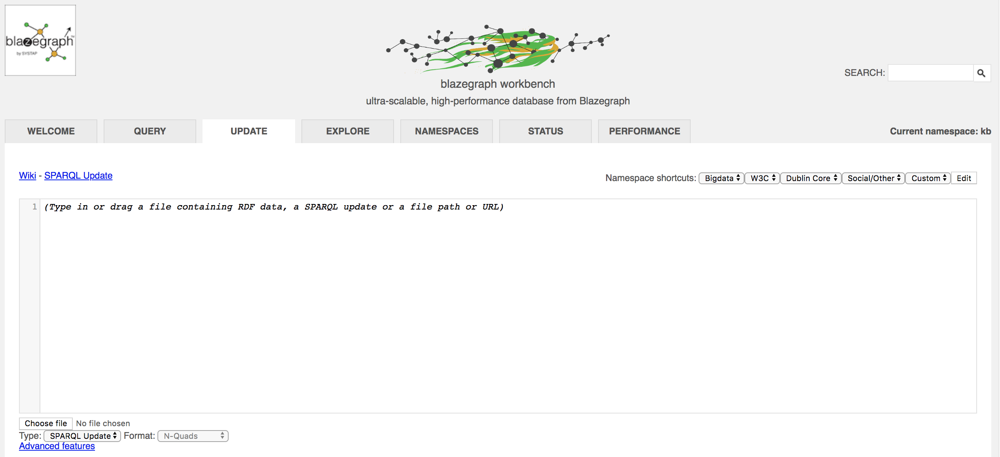

# graph-application
A simple web application that is talking to the graph database Blazegraph. The point of this tutorial is to provide anyone
the ability to run a graph database and write a simple web application over it.

## Knowledge Graphs
Knowledge graphs are part of symbolic AI. In short they capture what humans mean when they use certain words e.g. when you search for "Jaguar", do you mean the animal or the car brand.
For example, at Zalando, the workplace of the author, understanding the customers' language in search and talking to customers in a language they understand is very important, and the Fashion Knowledge Graph build at Zalando drives that.

## About this Tutorial
This tutorial will help you to set up our own graph databases, add data into it, and use it in a web application.
It will give you a quick start to building and hosting your own knowledge graph.
If you want to explore the topic further in some of your applications, you can use this technology and expand on it.

# Getting started

## Requirements

Make sure you have installed [Docker](https://docs.docker.com/install/)

## Running a Graph Database

For this tutorial I am using [Blazegraph](https://wiki.blazegraph.com/wiki/index.php/About_Blazegraph) graph database,
because it is open-source and [most-likely](https://www.i-programmer.info/news/84-database/11358-amazon-neptune-graph-database.html)
Amazon neptune available on AWS is [based on Blazegraph](https://www.i-programmer.info/news/84-database/11358-amazon-neptune-graph-database.html).
Certainly the experience of using both is the same.


### Run Blazegraph from a Docker image
The easiest way to run Blazegraph is to use a popular Docker image. You can find
those in Dockerhub. In this tutorial we will use [lyrasis/blazegraph](https://hub.docker.com/r/lyrasis/blazegraph/).

Make sure you have installed [Docker](https://docs.docker.com/install/)

Then run the following command to run Blazegraph according to the chosen docker image.
```
docker run --name blazegraph -d -p 8889:8080 lyrasis/blazegraph:2.1.4
```

To see the dashboard for Blazegraph, navigate with your browser to the [localhost port 8889](http://localhost:8889/bigdata/).

### Add Data to Blazegraph

Make sure you have Blazegraph running. You can see that it is running by typing

```
docker ps
```

Navigate to the dashboard of Blazegraph [localhost port 8889](http://localhost:8889/bigdata/)
and choose the tab "Update"




After that in the root folder

```npm install```